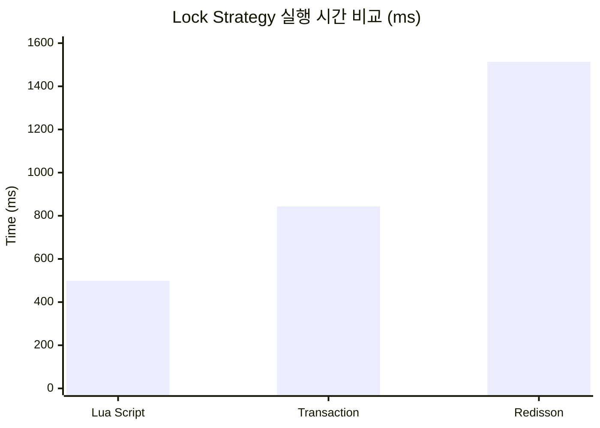

# Redis Lock Strategy 성능 비교 보고서

게임방 퇴장 시 방장 재지정 로직의 동시성 제어를 위한 3가지 방식을 구현하고 성능을 비교했습니다.

---

## 테스트 결과 요약

| 전략              | 성능 (100회)  | 동시성 테스트 (10 threads) | Race Condition |
| ----------------- | ------------- | -------------------------- | -------------- |
| **Lua Script**    | **0.499s** ✅ | 0.144s                     | 없음           |
| Redis Transaction | 0.843s        | 0.176s                     | 없음           |
| Redisson RLock    | 1.513s        | 0.514s                     | 없음           |

> [!IMPORTANT]
> **Lua Script가 Redisson RLock 대비 약 3배 빠른 성능**을 보였습니다.

---

## 성능 지표 상세



---

## 기술적 분석

### 1. Redisson RLock (비관적 락)

```
특징: 낙관적 락 획득 → 작업 수행 → 락 해제
네트워크 왕복: 2~3회 (SETNX + GET/DEL)
장점: 안정성, 재진입 가능, 자동 해제
단점: 외부 라이브러리(~3MB), 오버헤드
```

### 2. Redis Transaction (WATCH/MULTI/EXEC)

```
특징: 낙관적 락 + 충돌 시 재시도
네트워크 왕복: 3~4회 (WATCH → READ → MULTI → EXEC)
장점: 추가 라이브러리 불필요
단점: 높은 동시성에서 재시도 증가
```

### 3. Lua Script (원자적 실행) ✅

```
특징: 모든 로직이 Redis 서버에서 단일 실행
네트워크 왕복: 1회 (EVAL)
장점: 완벽한 원자성, 최고 성능, 추가 라이브러리 불필요
단점: Lua 스크립트 관리 필요, 디버깅 복잡
```

---

## 최적 방안 권고

> [!TIP]
> **Lua Script를 메인 전략으로 채택**하고, Redisson은 안전망으로 유지하는 것을 권장합니다.

### 채택 근거

1. **성능**: 3배 빠른 응답 시간 (1.513s → 0.499s)
2. **원자성**: Race Condition 구조적 불가능
3. **의존성**: Redisson 라이브러리 선택적 사용 가능
4. **확장성**: 고트래픽 환경에서 유리

### 설정 방법

```yaml
# application.yml
game-room:
  lock-strategy: lua # redisson | transaction | lua
```

---

## 면접 대비 Q&A

### Q1. 왜 Lua Script를 선택했나요?

> "읽기-판단-쓰기" 패턴에서 **원자성이 핵심**입니다. Lua Script는 모든 로직이 Redis 서버에서 실행되어 네트워크 왕복이 1회이고, 실행 중 다른 명령이 끼어들 수 없어 Race Condition이 구조적으로 불가능합니다.

### Q2. Redisson을 안 쓰는 이유는?

> Redisson은 훌륭한 라이브러리지만, 이 케이스에서는 **과도한 추상화**입니다. 단순히 락 획득/해제만 하면 되는데 ~3MB의 의존성과 Netty 리소스가 추가됩니다. Lua Script로 같은 결과를 더 효율적으로 달성할 수 있습니다.

### Q3. Redis Transaction의 문제점은?

> WATCH 기반 낙관적 락은 **충돌 시 재시도가 필요**합니다. 동시 요청이 많으면 재시도 횟수가 증가하고, 최악의 경우 모든 클라이언트가 재시도하는 "라이브락" 상황이 발생할 수 있습니다.

### Q4. Lua Script의 단점은 없나요?

> 디버깅이 어렵고, Redis 버전에 따라 기능 제한이 있을 수 있습니다. 또한 스크립트 실행 중 Redis가 블로킹되므로, **복잡한 로직에는 부적합**합니다. 이 케이스는 간단한 방장 재지정이므로 적합합니다.

### Q5. 분산 환경에서 동작하나요?

> 네. Lua Script는 Redis 서버에서 실행되므로, 어떤 애플리케이션 인스턴스에서 호출하든 동일하게 동작합니다. 단, Redis Cluster에서는 키가 같은 슬롯에 있어야 합니다.

---

## 구현 파일

| 파일                                                                                                                                               | 설명                    |
| -------------------------------------------------------------------------------------------------------------------------------------------------- | ----------------------- |
| [HostAssignmentLockStrategy.java](file:///c:/KoSpot-backend/src/main/java/com/kospot/infrastructure/lock/strategy/HostAssignmentLockStrategy.java) | Strategy 인터페이스     |
| [RedissonLockStrategy.java](file:///c:/KoSpot-backend/src/main/java/com/kospot/infrastructure/lock/strategy/RedissonLockStrategy.java)             | Redisson 구현           |
| [RedisTransactionStrategy.java](file:///c:/KoSpot-backend/src/main/java/com/kospot/infrastructure/lock/strategy/RedisTransactionStrategy.java)     | Transaction 구현        |
| [LuaScriptStrategy.java](file:///c:/KoSpot-backend/src/main/java/com/kospot/infrastructure/lock/strategy/LuaScriptStrategy.java)                   | Lua Script 구현         |
| [LockStrategyConfig.java](file:///c:/KoSpot-backend/src/main/java/com/kospot/infrastructure/lock/config/LockStrategyConfig.java)                   | 설정 기반 Strategy 선택 |
| [LockStrategyBenchmarkTest.java](file:///c:/KoSpot-backend/src/test/java/com/kospot/infrastructure/lock/LockStrategyBenchmarkTest.java)            | 벤치마크 테스트         |
