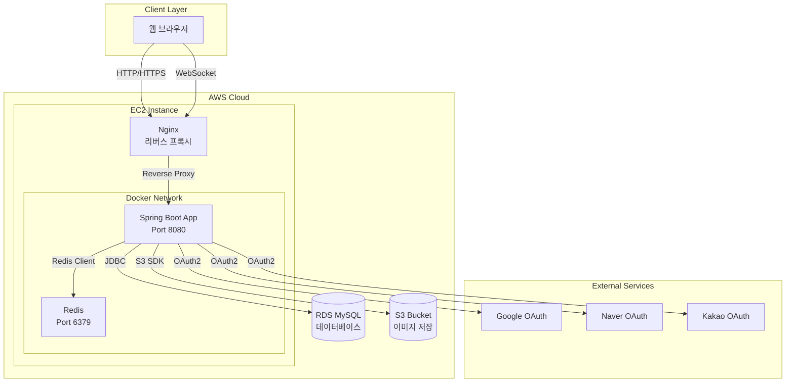
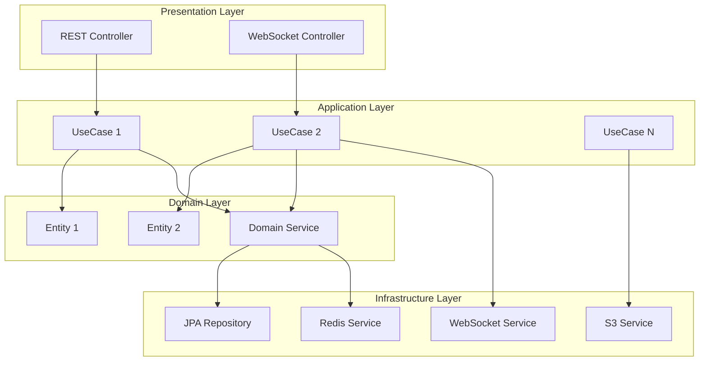
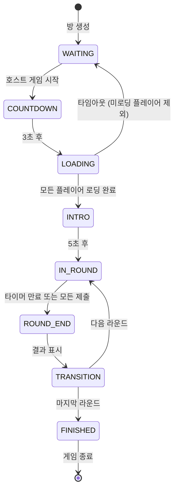
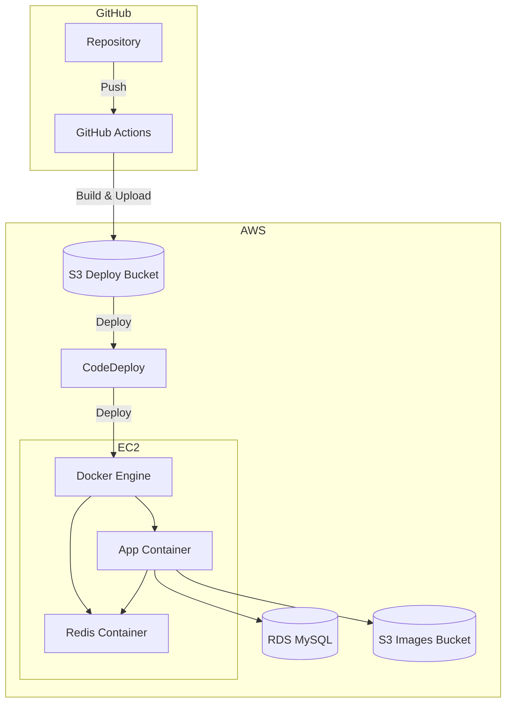
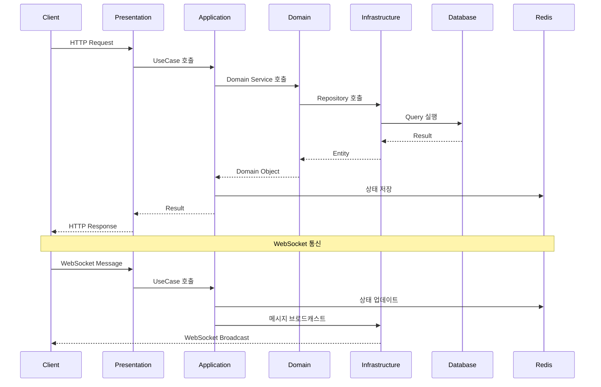
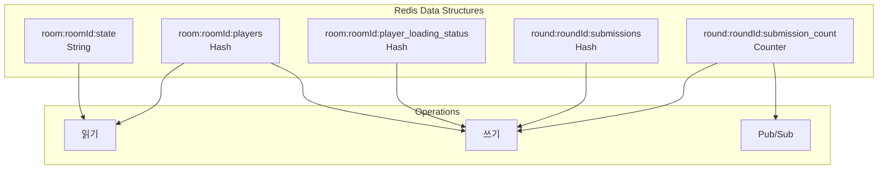
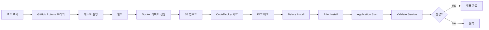

# KoSpot 시스템 아키텍처 다이어그램

## 전체 시스템 아키텍처



## 계층형 아키텍처 구조



## 멀티플레이어 게임 플로우



## WebSocket 채널 구조

```mermaid
graph LR
    subgraph "Global Channels"
        Lobby[/topic/lobby]
    end
    
    subgraph "Room Channels"
        Chat[/topic/room/roomId/chat]
        PlayerList[/topic/room/roomId/playerList]
        Status[/topic/room/roomId/status]
        Countdown[/topic/room/roomId/countdown]
    end
    
    subgraph "Game Channels"
        Timer[/topic/room/roomId/game/gameId/timer]
        Result[/topic/room/roomId/game/gameId/round/roundId/result]
        Transition[/topic/room/roomId/game/gameId/round/roundId/transition]
    end
    
    Client[클라이언트] --> Lobby
    Client --> Chat
    Client --> PlayerList
    Client --> Status
    Client --> Countdown
    Client --> Timer
    Client --> Result
    Client --> Transition
```

## 배포 아키텍처



## 데이터 흐름도



## 게임 상태 관리 (Redis)



## CI/CD 파이프라인



